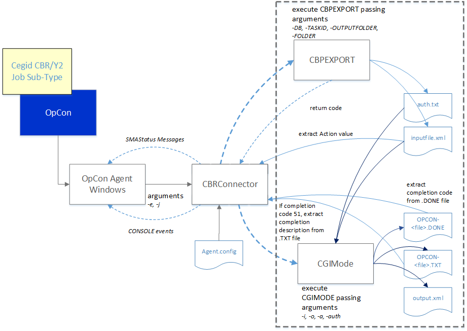

# Cegid-CBR/Y2 Connector

The current connector implementation consists of a Windows batch program that is executed by the Windows Agent (see figure 1). 
The job definitions are entered as Windows jobs using the Cegid CBR/Y2 job subtype. 
The job definitions consist of the environment and the job id. 
When the job is scheduled by OpCon, the definitions are passed as arguments (-e databasename -j jobid) to the Cegid CBR Connector

The Cegid CBR Connector starts up and reads the configuration information from the Agent.config file and performs the following tasks.

- The CBRConnector takes a timestamp for later comparison purposes.
- The CBRConnector creates the required directories if they do not exist using the root definitions configured in the Agent.config file and the databasename and jobid arguments (i.e. \<***root directory***\\***databasename***\\***jobid***\>).
- The CBRConnector calls the CBPEXPORT program passing the required arguments (-DB \<***databasename***\>, -TASKID \<***jobid***\>, -OUTPUTFOLDER \<***full path of inputfile.xml***\>, -FOLDER \<***databasename***\>. 
  The CBPEXPORT program then generates the inputfile.xml and the auth.txt files and returns a completion code of 0 or 24 if everything is successful (depends on the CBR application version).
- Upon successful completion, the CBRConnector reads the inputfile.xml and extracts the ACTION value from the file. 
- If the inputfile.xml contains an ACTION value, the CBRConnector calls the CGIMODE program passing the required arguments (-i \<***full path to inputfile.xml***\>, -o \<***full path to output.xml***\>, -a \<***action value previously extracted***\>, 
  -auth \<***full path to auth.txt***\>). The CGIMODE program executes and generates the OPCON-\<***timestamp***\>-TACHE-\<***jobid***\>.DONE and OPCON-\<***timestamp***\>-TACHE-\<***jobid***\>.TXT files. 
  These file names contain a timestamp and the contents of the OPCON-\<***timestamp***\>-TACHE-\<***jobid***\>.DONE file also contains the task completion date and time.
- When the CGIMODE program completes, the CBRConnector extracts the date and time values from the OPCON-\<***timestamp***\>-TACHE-\<***jobid***\>.DONE and a comparison is made between these values and the previous timestamp taken for comparison purposes. 
  If the date and time values are greater than the comparison value, the CBRConnector extracts the completion code form the \<***file***\>.DONE. If the completion code is 51, then the CBRConnector examines the OPCON-\<***timestamp***\>-TACHE-\<***jobid***\>.TXT 
  for a matching text string that indicates the job completion condition. This string value is then converted to the required completion code.
- The CBRConnector connector appends stdout & stderr from the CBPEXPORT program, stdout, stderr, OPCON-\<***timestamp***\>-TACHE-\<***jobid***\>.DONE & OPCON-\<***timestamp***\>-TACHE-\<***jobid***\>.TXT to the OpCon job log.
- During the CBRConnector execution, if the SmaStatus configuration value is set to True status messages will be submitted from the CBRConnector to OpCon. These values are then displayed as part of the job description in the Operations views.  
- During the CBRConnector execution, if the ConsoleDisplay configuration value is set to True CONSOLE:DISPLAY messages will be submitted from the CBRConnector to OpCon. These values are then displayed in the OpCon log. 

---