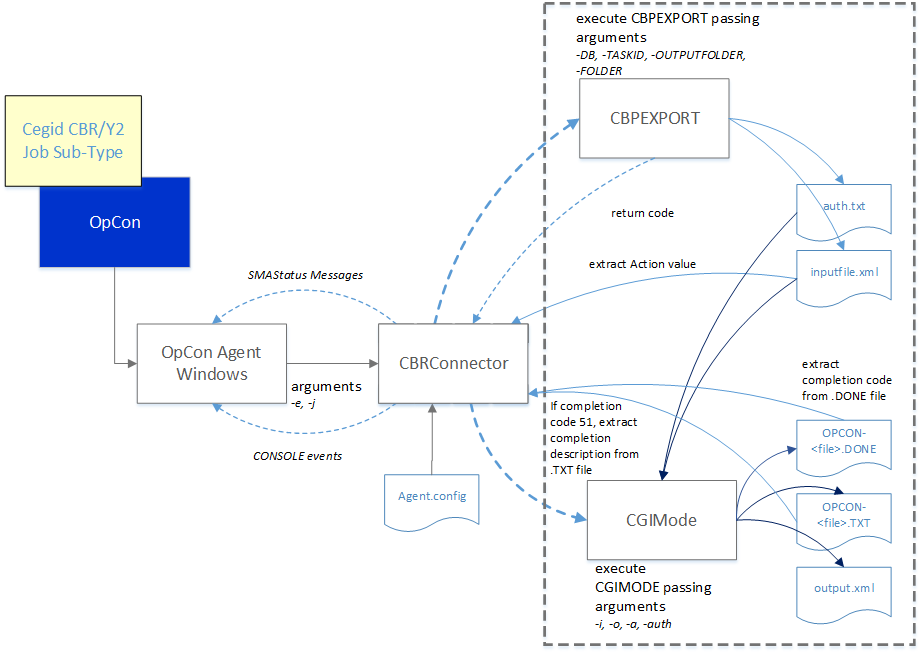

## What Is It?

The Cegid CBR Connector is a Windows batch program that OpCon uses to schedule and monitor Cegid CBR/Y2 jobs. OpCon submits jobs using the Cegid CBR/Y2 job subtype defined in Enterprise Manager, passing the database name and job ID as arguments to the connector.

- Use this when you need OpCon to automate Cegid CBR/Y2 business process jobs in a Windows environment.
- Use this when you want OpCon job logs to include the full output of CBPEXPORT and CGIMODE execution, including status messages and completion codes.
- Use this when you need centralized monitoring of Cegid CBR/Y2 processing results alongside other OpCon-managed workloads.

The current connector implementation consists of a Windows batch program executed by the Windows Agent. Job definitions are entered as Windows jobs using the Cegid CBR/Y2 job subtype. The job definitions consist of the environment and the job ID.

When OpCon schedules a job, the definitions are passed as arguments (`-e databasename -j jobid`) to the Cegid CBR Connector.

## How It Works

The CBR Connector performs the following tasks when a job runs:

1. Takes a timestamp for later comparison purposes.
2. Creates the required directories if they do not exist, using the root definitions configured in the `Connector.config` file and the database name and job ID arguments (for example, `\<root directory\>\<databasename\>\<jobid\>`).
3. Calls the CBPEXPORT program, passing the required arguments (`-DB <databasename>`, `-TASKID <jobid>`, `-OUTPUTFOLDER <full path of inputfile.xml>`, `-FOLDER <databasename>`). CBPEXPORT generates the `inputfile.xml` and `auth.txt` files and returns a completion code of 0 or 24 on success (depending on the CBR application version).
4. Reads `inputfile.xml` upon successful completion and extracts the ACTION value.
5. Calls the CGIMODE program if `inputfile.xml` contains an ACTION value, passing the required arguments (`-i <full path to inputfile.xml>`, `-o <full path to output.xml>`, `-a <action value>`, `-auth <full path to auth.txt>`). CGIMODE generates the `OPCON-<timestamp>-TACHE-<jobid>.DONE` and `OPCON-<timestamp>-TACHE-<jobid>.TXT` files.
6. Compares date and time values from the `.DONE` file against the initial timestamp. If the values are greater, the connector extracts the completion code. If the code is 51, the connector examines the `.TXT` file for a matching text string and converts it to the required completion code.
7. Appends CBPEXPORT stdout and stderr, CGIMODE stdout and stderr, the `.DONE` file, and the `.TXT` file to the OpCon job log.
8. Submits SmaStatus messages to OpCon during execution when `SmaStatus=True` is configured, displaying progress information in the Operations views.
9. Submits `CONSOLE:DISPLAY` messages to OpCon during execution when `ConsoleDisplay=True` is configured.

## FAQs

**What OpCon components are required to use the Cegid CBR Connector?**

The connector requires an OpCon Windows Agent installed on the same Windows server as the Cegid CBR/Y2 application.

**What arguments does OpCon pass to the connector?**

OpCon passes `-e <databasename>` and `-j <jobid>` as arguments when a Cegid CBR/Y2 job runs.

**Where can I view connector execution results?**

Results appear in the OpCon job log, which includes output from CBPEXPORT, CGIMODE, and the `.DONE` and `.TXT` files generated by CGIMODE.

**What is the difference between SmaStatus and ConsoleDisplay?**

`SmaStatus=True` sends progress messages that appear in the OpCon Operations views as job status information. `ConsoleDisplay=True` sends `CONSOLE:DISPLAY` events that appear in the OpCon log.

## Glossary

**CBRConnector** — The Windows batch program that acts as the integration layer between OpCon and the Cegid CBR/Y2 application.

**CBPEXPORT** — A Cegid CBR/Y2 program that exports job definitions to `inputfile.xml` and `auth.txt`.

**CGIMODE** — A Cegid CBR/Y2 program that processes the exported job definition and generates the `.DONE` and `.TXT` completion files.

**Connector.config** — The configuration file that stores connector settings, including folder paths, program locations, and runtime options.

**Job subtype** — An Enterprise Manager plug-in that provides the Cegid CBR/Y2 job definition screen within the OpCon Windows job type.

**User Defined RC** — A configuration section that maps Cegid CBR/Y2 error description strings to integer completion codes returned to OpCon when the `.DONE` file contains completion code 51.
